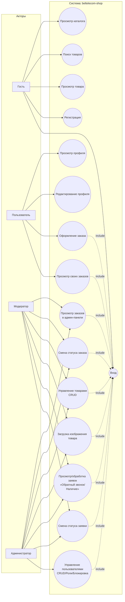
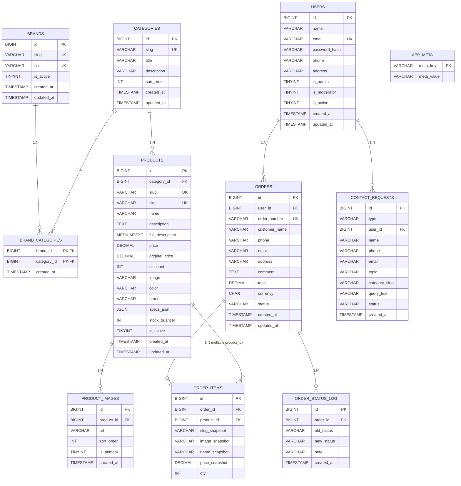

# Диаграммы по проекту `beltelecom-shop`

Ниже приведены 3 диаграммы, построенные по текущей структуре кода и схемы БД проекта.

---

## 1) Диаграмма классов (архитектура и связи ключевых элементов)

Примечание: backend реализован в процедурном стиле PHP (функции), поэтому UML ниже отражает **логические модули** (контроллеры/сервисы/библиотеки) как «классы-компоненты» для наглядности архитектуры.

```mermaid
classDiagram
direction LR

class ApiEntryPoint {
  +index.php
}

class RouterDispatcher {
  +dispatch_api_request(method, path)
}

class HttpRequest {
  +route_path()
  +read_json_body()
}

class Response {
  +json_response(payload, status=200)
  +json_error(message, status, details?)
}

class Db {
  +db(): PDO
}

class Validation {
  +validate_user_email(email): ?string
  +validate_user_phone_optional(phone): {error, phone}
  +validate_user_address_format(address): ?string
  +validate_user_address_optional(address): {error, address}
  +normalize_user_email(email): string
  +normalize_user_address(address): string
}

class AuthService {
  +current_user_id(): ?int
  +require_auth_user_id(): int
  +get_auth_user_by_id(id): ?array
  +require_admin()
  +require_catalog_manager()
}

class CatalogService {
  +get_categories_list(): array
  +get_products_by_category_slug(slug): array
  +get_product_by_id(id): ?array
  +get_recent_products(limit): array
  +search_products(q, limit): array
  +search_products_starts_with(q, limit): array
}

class OrderService {
  +place_order(body, authUserId, authUser): array
  +get_orders_for_user(userId): array
  +get_orders_for_staff(limit): array
  +update_order_status_for_staff(orderId, status): array
}

class ContactRequestService {
  +create_callback_request(body): array
  +create_stock_request(body): array
  +list_contact_requests(type, status, search): array
  +update_contact_request_status(id, status): array
}

class AdminProductService {
  +admin_format_product(row): array
  +admin_fetch_product_row(id): ?array
  +admin_read_specs_from_body(body): ?array
}

class AdminUserService {
  +admin_format_user(row): array
  +admin_fetch_user_row(id): ?array
  +admin_list_users(search, status, role): array
}

class AuthController {
  +handle_auth_request(method, path): bool
}

class CatalogController {
  +handle_catalog_request(method, path): bool
  +handle_category_slug_request(method, path): bool
}

class OrdersController {
  +handle_orders_request(method, path): bool
}

class AdminProductsController {
  +handle_admin_products_request(method, path): bool
}

class AdminUsersController {
  +handle_admin_users_request(method, path): bool
}

class ContactRequestsController {
  +handle_contact_requests_request(method, path): bool
}

ApiEntryPoint --> RouterDispatcher : calls
ApiEntryPoint --> HttpRequest : uses
ApiEntryPoint --> Response : uses
ApiEntryPoint --> Db : bootstrap DB

RouterDispatcher --> AuthController
RouterDispatcher --> CatalogController
RouterDispatcher --> OrdersController
RouterDispatcher --> AdminProductsController
RouterDispatcher --> AdminUsersController
RouterDispatcher --> ContactRequestsController

AuthController --> Validation
AuthController --> Db
AuthController --> AuthService

CatalogController --> CatalogService

OrdersController --> OrderService
OrdersController --> AuthService

AdminProductsController --> AuthService
AdminProductsController --> AdminProductService
AdminProductsController --> Db

AdminUsersController --> AuthService
AdminUsersController --> Validation
AdminUsersController --> AdminUserService
AdminUsersController --> Db

ContactRequestsController --> ContactRequestService
ContactRequestsController --> AuthService
ContactRequestsController --> Db

CatalogService --> Db
OrderService --> Db
OrderService --> Validation
ContactRequestService --> Db
AdminProductService --> Db
AdminUserService --> Db
```

---

## 2) Диаграмма вариантов использования (Use Case)



Привязка к API (по коду):
- **Авторизация/профиль**: `/auth/register`, `/auth/login`, `/auth/logout`, `/auth/me`.
- **Каталог**: `/categories`, `/products`, `/products/{id}`, `/search`, `/{categorySlug}`.
- **Заказы**: `/orders`, `/admin/orders`, `/admin/orders/{id}/status`.
- **Админ товары**: `/admin/products`, `/admin/products/{id}`, `/admin/products/upload-image`.
- **Админ пользователи**: `/admin/users`, `/admin/users/{id}`.
- **Заявки**: обрабатываются контроллером `ContactRequestsController` и сервисом `ContactRequestService`.

---

## 3) ER-диаграмма (Сущность–Связь) по `database/schema.sql`



